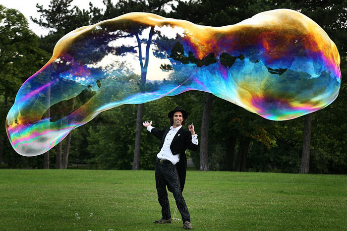
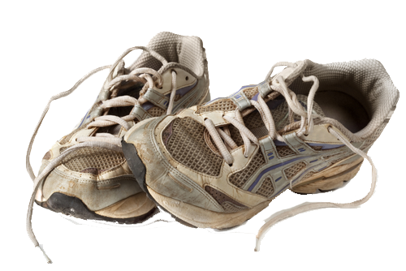

# Project 1: Documentation of an Object

*Due Wednesday, September 23rd at the beginning of class.* 

This assignment asks you to: 

* "capture" (with any of a variety of acquisition technologies) some object that intrigues/fascinates/grips you, and then
* design a presentation that somehow "unlocks a portion of its spirit" -- whatever that could mean -- in some technologized medium. 

Below are four potential starting points for helping you select a possible "charged" object.

--

### (A) ***Something Ephemeral*** 

 

*(This bubble is just an example.)*

### (B) ***Something which has accompanied you everywhere***

You might initially think this means "your most treasured possession", but it could also be ***something you can't seem to get rid of***, such as a gift you've always hated, a broken loved item...

 

### (C) A ***[Lost Childhood Object](https://www.youtube.com/watch?v=QgHsYOybXa0)*** (by Lenka Clayton):

### or (D) ***[Embarrassing Object](https://www.youtube.com/watch?v=7mxM6mNSv5s)*** (by Geof Oppenheimer):

Got another concept? *Speak with the professor. We're flexible.*

--

### Task

Using expanded capture techniques, acquire the object and realize it object virtually. Your presentation should unlock some portion of its spirit 

--

### Requirements and Constraints

* Regardless of any intermediate processes or materials that your concept may or may not require (e.g. clay, papier-mache, etc.), your final project must be a virtual manifestation. Acceptable projects are limited to one of the following forms: 
	* a real-time software executable (created, for example, in Unity3D, openFrameworks, Processing, three.js, etc.) (Note: *interactivity* is optional).
	* a video or computer-generated animation 
	* a computer-generated rendering 
* Regardless of any subsequent digital transformations you might apply, you must "capture" "something" real (using a "device") as the initial basis for your virtual manifestation. 
* Your virtual object must be presented on a neutral background. 

#### Details 

* **Create** a Markdown document called <code>project1.md</code> in your student folder. You will document your project in this file. 
* In this document, **write** a couple of paragraphs (150-250 words) about the experience of creating the piece. Critique your work: where do you feel you succeeded? Where do you feel you fell short of what you'd hoped to achieve? What did you learn? 
* *All* projects must be documented with at least one digital image at least 1600 pixels wide. 
* With the exception of still renderings, *all* projects will be documented through online video hosted on YouTube or Vimeo, and linked from the <code>project1.md</code> page. (Note, Markdown does not allow video embedding, so use the technique [described here](https://github.com/adam-p/markdown-here/wiki/Markdown-Cheatsheet#videos).) Software executables must be documented with a screencaptured video.
* Optionally, you are invited to publish 3D files to sharing/hosting sites such as [Thingiverse](http://www.thingiverse.com/thing:19276) or [Sketchfab](https://sketchfab.com/models/5bb11bc427eb49d7952fb857a1e3d98f).
* **Submit** your files (<code>project1.md</code>, various images, etc.) in the form of a pull request to this repository. 

-- 

#### What would be a "minimum viable project"? 

One example of a possible solution might be something like this: 

* Make a thing out of clay
* 3D scan it
* Bring it into Unity3D
* Add some sparkles, make it wiggle
* Record a screengrab video

*Be more creative than that.*

-- 

#### References

A list of references and viewings is available **[here](object-references.md)**. 

-- 

#### What Options do I have for Scanning Something? 

Hardware Options: 

* **3D Systems iSense -** 3D Scanner for iPad Mini Retina. [Tutorial](http://cubify.com/info/tutorialssense)

* **Kinect-** (v1 and v2)
	* [OpenFrameworks](https://github.com/micuat/ofxActiveScan) C++ wrapper for creative coding.
	* [Processing (Java)](https://github.com/ivaylopg/RGBDToolkit-to-Processing) Creative coding in Java.
	* [Skanect](http://skanect.occipital.com/) Seems good for beginners.
	* Kinect Fusion 
       - Fast to process
		- Regular geometry
		- real time feedback
		- Non-cloud based
		- Windows only
		- Limited scale
		- Does not work in sunlight
		- Requires specific sensor with wall power
		- No texture map, per vertex color
		- [More introduction info](https://msdn.microsoft.com/en-us/library/dn188670.aspx)
		- [Video example](https://www.youtube.com/watch?v=of6d7C_ZWwc	)
		- [Tools and resources](http://www.microsoft.com/en-us/kinectforwindows/develop/downloads-docs.aspx)
* **[DepthKit](http://depthkit.tv/)**
	* Made by [Specular](http://www.specular.cc/), a RGB D filmmaking tool 
	* Combines a Kinect with DSLR.
	* Can be viewed in 3D program like Maya, Cinema4D.
	* Everything is avalible for lending, including mounts.
	* [Depthkit js](https://vimeo.com/123520067) 

*A combination of four Depth Kits to capture a 360 volume of skateboarder.*

* **Matter and Form 3D Scanner**
More difficult, but still available:
* [Pitt Orthopedics](http://www.engineering.pitt.edu/Sub-Sites/Labs/Orthopaedic_Robotics/Contact/)
* [School of Art 3d scanner at the DAS](http://www.cmu.edu/art/digital-arts-studio/3dscanning/index.html)

Software tools:

* **Agisoft photoscan -** Professional edition. Allows for much higher resolution images and larger scenes than any other application available. Considered best photogrammetry software by many. [Video](https://www.youtube.com/watch?v=DzCeHFEUaro)
  * [Tutorial from Specular](https://vimeo.com/specularprojects/photoscan1) (Vimeo)
  * [Part 2 of Specular tutorial](https://vimeo.com/specularprojects/photoscan2) (Vimeo)

*A point cloud image of the Monteath Mausoleum (not finished), generated.*

* **123D Catch -** Works with any regular camera, even your cell phone.
	- Works at any scale
	- Works outside
	- Generates a texture map
	- Photographic quality in color 
	- Slow to process
	- Cloud based
	- Dense geometry
	- Tools are not free and open
	- No real time feedback
	- More chaotic geometry 
	- [How to](http://www.123dapp.com/howto/catch)

                *Gargoyle in 123D Catch*

* **Visual FSM & Meshlab -** If you don't like 123D Catch or Agisoft. [Tutorial](http://www.instructables.com/id/Make-a-3D-model-from-pictures/?ALLSTEPS)

---

### After it's Scanned, What Can I Do?
*(The following materials are from James George and Alexander Porter.)*

.OBJ and .PLY files are commonly used open-source 3D file formats. If you need to convert your scanned object's format:

* **MeshLab -** This free tool provides a very handy way to convert formats; it's like a 3D pocket knife. It can also be used to reduce and combine meshes. *see below for how to reduce meshes using a few other applications. 
	* [Here](https://www.youtube.com/playlist?list=PLBBF41579E4B65566) are some more comprehensive tutorials for cleaning geometry in MeshLab

After capturing your geometry, the following links will help you get it into your preferred application:

* **Unity3d -** Supports .OBJ like any other 3D file format. [More info](https://unity3d.com/)
* **Processing -** The Saito .OBJ loader
[Processing Library](https://code.google.com/p/saitoobjloader/) and
[Tutorial Video](https://www.youtube.com/watch?v=6VSaneuiaWs) (Scrub to 3:30 for the good stuff)
* **OpenFrameworks-** The ofMesh and ofVboMesh objects support PLY's with color with the mesh `.load()` function. 
    * The built-in addon *ofxAssimpModelLoader* also works with .OBJ files.
    * Satoru Higa [has a nice OBJ loader addon]
(https://github.com/satoruhiga/ofxObjLoader), *ofxObjLoader*.
* **Cinder -** A powerful toolbox for programming graphics, audio, video, networking, image processing and computational geometry also in C++.
    * [Cinder has built in support for .OBJ files](http://libcinder.org/docs/v0.8.3/classcinder_1_1_obj_loader.html)
    * [There is also a Mesh extension block that supports PLY](https://github.com/simongeilfus/Cinder-OpenMesh)
    * [Meshes in cinder tutorial](http://www.creativeapplications.net/tutorials/guide-to-meshes-in-cinder-cinder-tutorials/)

* 3D Printing
	* **NetFabb -** Helps you clean up models if you wish to 3D print them. You'll want to take them through the STL format in MeshLab.
[Download](http://www.netfabb.com/downloadcenter.php?basic=1)
	* **MakerBot -** If you're using a MakerBot, print using their software: [Download](http://www.makerbot.com/desktop)

Creative Tools: 
Many applications support .OBJ (and sometimes .PLY files)  

* **Photoshop-** (really!)
Photoshop natively supports importing and painting on 3D files. [Video](https://www.youtube.com/watch?v=mD39wgDoiHE)
* **After Effects-**
The 3D Animator Pro plugin (they offer a free trial) accepts OBJ files. [Video ](https://www.youtube.com/watch?v=eEQUba16V5o)
* **Plexus-** An amazing tool for After Effects that works on 3D geometry. [Video](https://www.youtube.com/watch?v=44hz_fsjX7o)
* **Blender-** Here is also mesh reduction tutorial. [Video]
(https://www.youtube.com/watch?v=ttU6Gz1W0Xw)

Programs like Maya, Cinema4D, Houdini, 3D Studio Max, Modo also work well with .OBJ files, but are beyond the scope of what we expect to teach in this class. If you know these programs, by all means use them for your projects!

--------------------------

Alignment:

* [Meshlab 3D Scanning: Alignment] (http://youtu.be/4g9Hap4rX0k)
* [Alignment and Registration in CloudCompare] (http://www.danielgm.net/cc/doc/wiki/index.php5?title=Alignment_and_Registration )
   * I've found that CloudCompare is really good for loading large pointclouds or found research data in lasercanning formats like .las, .xyz etc. and it will do a great job with Kinect or photogrammetry pointclouds. 

Reduction & Remeshing:

* Poisson Reconstruction in Meshlab - This is a good general purpose approach for Kinect or other pointclouds. Can also be used to combine meshes when used after "flatten visible layers" in Meshlab. 

Color

 * [MeshLab Features: Vertex Attribute Transfer](http://youtu.be/sKKmJdsk7Tg?list=UU70CKZQPj_ZAJ0Osrm6TyTg)

