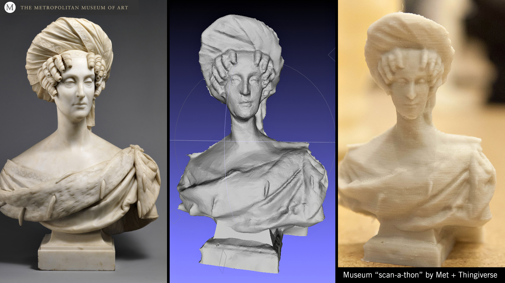
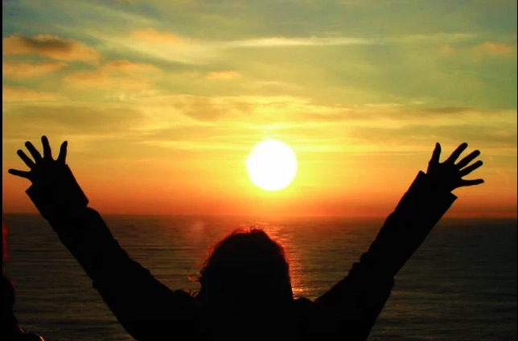

# 'Object' References

In this lecture, in laying the groundwork for your *[Object](assignment1-object.md)* ("still life") assignment, I present a series of works for your contemplation. The projects shown here consider a (by no means comprehensive) variety of ways in which the capture and display of objects has been treated in interactive and computational new media. 

## A Refresher On Still Life

*That pretty picture of flowers? It's probably about death. Here's why.* 

 (From *[Art of Arrangement: Photography and the Still Life Tradition](https://www.youtube.com/watch?v=iQ_ftM0ZXy8)*)

There's plenty more symbolism where that came from. See, for example, [here](http://www.easy-oil-painting-techniques.org/still-life-symbolism.html).

* **Flowers**, different flowers hold different meanings.  They can symbolize innocence, the four seasons, or religious symbols.  The rose for instance, stands for love, the lily for purity, and the sunflower for devotion.  
* **Birds**, or a pair of birds represent the resurrection of the soul after death.
* The **bee**, as well as the **butterfly**, are symbols of hope, and because they are rather delicate, are a reminder to the fragility of life.
* The **mouse**, being a very fertile animal, became a symbol of lechery and destruction.
* **Ivy**, as an evergreen symbolizes eternal life.  
* The **peach** symbolizes truth and salvation, and is used as a replacement to the maligned apple.
* **Feathers** symbolize the virtues of hope, faith, and charity (in religious works), and they represent freedom (by enabling flight) and the heavens.
* **Skulls** symbolize mortality. 
* **Books**, learning or of transmitting knowledge.
* The **Lute with broken strings**, Death or discord.
* The **candle** can indicate the passing of time, faith in God (when its burning).  When extinguished, it means death, or the loss of innocence, and the corruption of matter.
* The **clock**, the passing of time. 
* **Mirror**: stands for truth or vanity. 

## Some Things to Contemplate

### Early Interactive Still Lifes

#### Shaw's *Golden Calf* (1994)

Here's an extremely early digital still life -- the *[Golden Calf](http://www.leonardo.info/gallery/gallery332/shaw.html)* responsive installation by Australian media art pioneer, Jeffrey Shaw. 
 
 

> This work is constituted by a white pedestal on which there stands an LCD colour monitor. The viewer of this work picks up and holds this monitor in his hands. The screen shows a representation of the pedestal with a computer-generated image of a golden calf on top. By moving the monitor around the actual pedestal the viewer can examine this golden calf from above and below and all sides. Thus the monitor functions like a window that reveals a virtual body apparently located physically in the real space.

> The golden calf has a shiny mirror-like surface in which the viewer sees reflections of the actual venue of the installation. These are previously digitised photographs of the room that are 'reflection-mapped' onto the calf's skin. While the viewer himself is not included in this digitised reflection of the environment, he does see himself refelected on the glass surface of the LCD screen.The immateriality of this golden calf is further emphasised by the fact that only its outer surfaces are modelled, so that if the viewer moves the monitor screen into the calf's body none of its interior surfaces are visible.

> In The Golden Calf the body is no longer a corporeal object but instead the immaterial subject of a specifically physical process of disclosure. When moving the monitor screen up, down and round the pedestal, the viewer performs what looks like a ceremonial dance around a technological pilaster construing an almost tangible phantasm.

More about the *[Golden Calf](http://www.artexetra.com/GoldenCalf.html)*.

#### Fujihata's *Beyond Pages* (1995)

Masaki Fujihata's 1995 interactive installation *[Beyond Pages](https://www.youtube.com/watch?v=6Ek2DW7aV68&t=0m40s)* is an early 'expanded book', featuring projections that respond to user actions and, further, cause effects in the world. 

 

> Although Beyond Pages presents a book as interface and simulates the action of turning pages, the two-dimensional limits of the surface and the inflexibility of the symbol are elegantly exceeded. To expand the usually quiet and still form of illustrated text, Fujihata introduces moments of surprise. 

--

### Scanning and Printing Things 

In 2012, the Metropolitan Museum of Art in NYC and Makerbot collaborated on a "Scanathon", in which the public roamed the museum with 123DCatch iPhone software, and uploaded [hundreds of 3D CAD models to Thingiverse](http://www.thingiverse.com/met/designs). Considered progressive for its time, more and more museums are publishing their [archives of sculpture as 3D models] (http://sites.museum.upenn.edu/monrepos/evidence/evidence.html). Scanning and sharing 3D models of objects is a common thing now. 

 

Perhaps less common is the kind of conceptual leap that's made when an artist like David Bowen produces a work like [46°41’58.365″ lat. -91°59’49.0128″ long. @ 30m](http://www.creativeapplications.net/objects/longitude-and-latitude-david-bowens-cnc-routed-sculptures-capture-the-waves/), a collection of CNC-routed clear acrylic sculptures generated from the 3D-scanned surface of the ocean (*wut?*): 

 

--

### Various still lifes by Samantha Taylor-Johnson

3D scanning is cool and I'mma let you finish, but it's not the only option available to us in *Experimental Capture*. Consider, for example, [time-lapse](undercranking.md). 

Samantha Taylor-Johnson (also known as Sam Taylor-Wood) has created some exceptional time-lapse still-lifes which make heavy reference to the history of painting:
 
* [*Still Life*](https://www.youtube.com/watch?v=pXPP8eUlEtk) (2001)
* [*A Little Death*](https://www.youtube.com/watch?v=01tx6u3lasM) (2002)

--

### Large and Small

In capturing representations of objects, keep in mind that the world of the microscope and the telescope are available to you.

* [*Brilliant Noise*](https://vimeo.com/1284717) (2006) is a hyperspectral portrait of the Sun, by the British media arts collective SemiConductor (Ruth Jarman and Joe Gerhardt

* Photogtapher Trevor Paglen photographs secret military sites with an astronomy telescope. He has a sereis called [Limit Telephotography](http://www.paglen.com/?l=work&s=limit) (2012) which is classified military bases, that are tucked away in remote parts of the US. [Here](http://petapixel.com/2015/03/17/trevor-paglen-on-photographing-secret-military-sites-with-a-telescope/) is more info about how he creates his work.

 
* *[Snowtime](https://vimeo.com/87342468)*, Microscopic timelapse of snowflakes forming, by Slava Ivanov (2014). Also by Slava Ivanov is *[Daphnia](https://vimeo.com/136739473)* (2015), high-speed microvideography of a water-flea.

 

--

### The Distributed Object

Carefully study the following two projects by former CMU MFA student, [Cassandra C. Jones](http://www.cassandracjones.com): 

* *[Eventide](http://www.cassandracjones.com/snap-motion-re-animations)* (2004) represents a single object -- the Sun -- constructed from hundreds of photos by different people. 

* *[Car Fire](http://www.cassandracjones.com/snap-motion-re-animations)* (2009) constructs a virtual, 'conceptual' object from many, similar, others.

--

### Box with the Sound of Its Own Making

Sometimes the conditions of capture are meaningful because of the conditions of presentation. There's nothing especially unusual about making a recording of doing some light woodwork, for example, unless you're constructing a... 

 

[*Box with the Sound of Its Own Making*](http://www.wikiart.org/en/robert-morris/box-with-the-sound-of-its-own-making-1961), by Robert Morris (1961) represents a unique scenario of superimposed capture and presentation: 

> As its title indicates, Morris's "Box with the Sound of Its Own Making" consists of an unadorned wooden cube, accompanied by a recording of the sounds produced during its construction. Lasting for three-and-a-half hours, the audio component of the piece denies the air of romantic mystery surrounding the creation of the art object, presenting it as a time-consuming and perhaps even tedious endeavor. In so doing, the piece also combines the resulting artwork with the process of artmaking, transferring the focus from one to the other. Fittingly, the first person in New York Morris invited to see the piece was John Cage. Cage was reportedly transfixed by Box with the Sound of Its Own Making, as Morris later recalled: *"When Cage came, I turned it on... and he wouldn't listen to me. He sat and listened to it for three hours and that was really impressive to me. He just sat there."*

--

### Capturing *Archives*; Presenting *Archives*

 

*Pockets Full of Memories* (2003-2006) by [George Legrady](http://pulse.mat.ucsb.edu/~g.legrady/) is an installation in which a data collection station allows the public to contribute a digital image of an object from their pockets, and add descriptive keywords. A Kohonen self-organizing map algorithm is used to visualize the data, arranging the contributors' objects according to similarities defined by their semantic descriptions.

 

The *[Nail Art Museum](https://www.youtube.com/watch?v=40pSU5ZM784&t=2m26s)*, by Jeremy Bailey (2014) is an augmented reality archive of virtual objects, presented on the artist's hands. 

 

--

### The Poetics of Capture & Manipulation

Here's cutting edge work in capturing and manipulating objects from SIGGRAPH. Consider the poetics of work like this. 

*Extracting Editable Objects from a Single Photo* by Tao Chen et al.:
 

*Viscous SPH deformation* by A. Peer et al.: 
 

