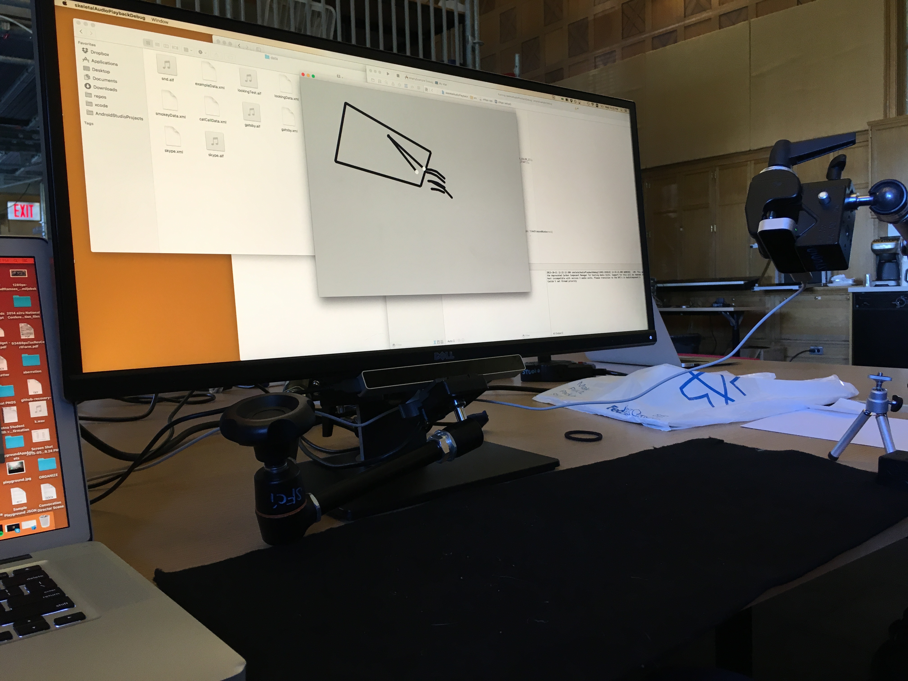
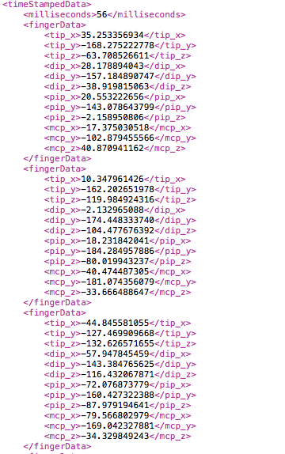
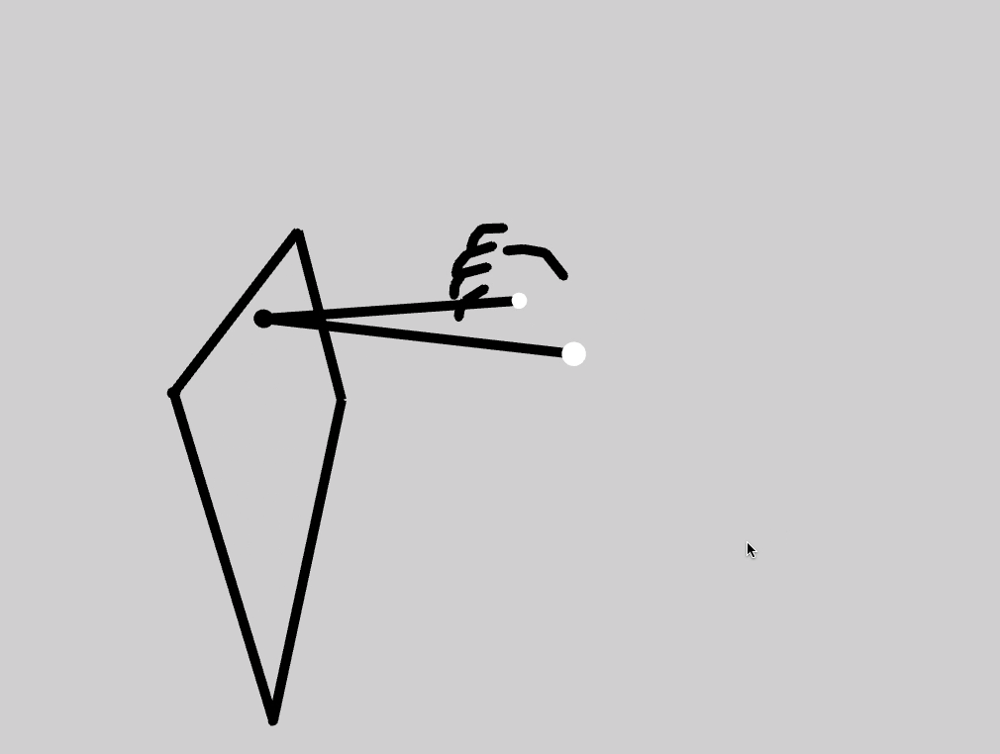

#Project 2: A Person in Time
## Skeletal Audio by Kevin M. Karol

[Project Video](https://youtu.be/adVzy3vWFUM)

This project was an exploration of how to capture and render three distinct data streams (eye tracking/gaze data, hand skeleton data and audio) and play them back together in order to capture the essence of a person.  It's premised on the idea that our hands and eyes are some of the most expressive parts of our body and that capturing their motion is a low-overhead way of distilling a person's essence as they speak.

There were two major components which needed to be built: a recording system for the data streams, and a player that could syncronize the audio and 3D spatial data.  To record, a Max Patch and OpenFrameworks app were created.  The Max Patch contained the button to start the recording, notifying the OpenFrameworks app to record timestamped data via an OSC message.  One problem that this joint system created was how libraries for the devices handled an app not being in focus.  Since the leap library does not refresh data without the app in focus, there is a slight delay from starting the audio recording to seeing the skeleton animate.

Figure 1: The recording setup

The data was output into two files - an XML file and an audio file.

Figure 2: XML Data written by one program and read by the other

The second portion of the project required building a syncronized audio/OpenGL player.  Again, in this instance the Audio was given control of playback, with the data from the XML being rendered according to the elapsed timestamp on the Audio.

Figure 3: A frame from the OpenGL renderding

Overall this system was quite adept at meeting the technical requirements and providing a really exciting method of playing back syncronized data streams.  Since the raw data is stored rather than captured images, new ways of representitng the data can be created within the renderer without requiring changes to the recording setup.

However, one of the major challenges that the project faced was displaying the discrete data streams in a way that put them in relationship with each other.  While rough estimants were made as to the relative position of the hand, screen and eyes, without additional metadata or an altered setup it isn't possible to have a recording in which the performer looks at their rendered hand skeleton as they turn an object around.

The system was also initially designed as a method of capturing a performance, most likely one which was driven by text/audio.  In capturing a number of performance types (Skype hangouts, poetry readings, reciting monologues) it became evident that having an activity that guided the participant's eyes and hands through specific actions would likely generate much more compelling data.  Without some directed purpose, having the subject being recorded be concious of their voice, hands and eyes at the same time made it hard for them to concentrate or act naturally.