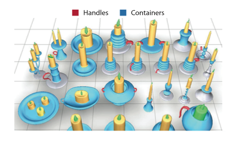

# Looking Outwards #1

### Shapes and Neural Nets

I read through all the papers from SIGGRAPH 2014 about shapes because I'm interested in shapes.
<a href="http://s2014.siggraph.org/attendees/technical-papers/sessions/shape-collection">They're listed here.</a> You can find the papers themselves on ACM.

There's a really promising field of research of the automatic segmentation and labeling of 3D models. Many algorithms are being developed to computationally recognize and learn about the shapes of objects. 

I found this very promising because of Kyle McDonalds recent work experimenting with a process described in the paper <a href="http://arxiv.org/abs/1508.06576">A Neural Algorithm of Artistic Style</a> by Gatys, et al. using neural networks to <a href="http://kylemcdonald.net/stylestudies/">transfer painting styles to other images</a>. I'm wondering now if a similar process could be applied to 3D models instead of images - I can imagine all sorts of interesting stuff you could do with that. Luckily Kyle is going to be in Pittsburgh this semester, so I'm excited to see if this is something feasible for me to work on. 
